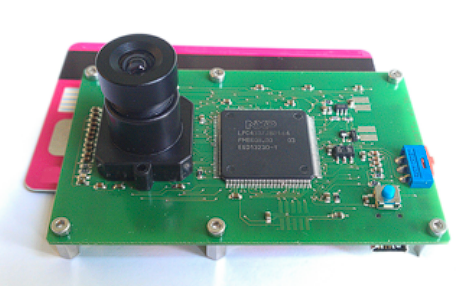
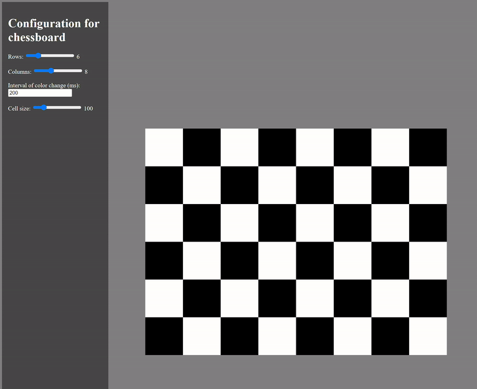

# Calibration tool for event-based cameras

## Event-based camera

Event-based cameras, also known as dynamic vision sensors (DVS), are advanced imaging devices that capture visual information differently from traditional frame-based cameras.
Instead of capturing frames at fixed intervals, event-based cameras detect changes in brightness at each pixel, producing a continuous stream of events that represent these changes.
This unique approach offers several advantages, including high temporal resolution, low latency, and efficient data processing, making them ideal for applications in robotics, autonomous vehicles, and other real-time systems.

We used a eDVS camera with onboard NXP microcontroller manufactured by Inivation.

## Problem

Traditional calibration methods for RGB cameras, such as those available in the OpenCV library, are not suitable for event-based cameras.
Typically, methods like `findChessboardCorners` and `calibrateCamera` use a static chessboard pattern to derive the intrinsic parameters of the lens and sensor.
However, event-based cameras require motion to detect changes in brightness, rendering a static chessboard pattern invisible.

## Use

To address this challenge, we developed a web application that displays a chessboard with changing colors.
The continuous color changes create detectable brightness variations, making the chessboard visible to the event-based camera.

1. Clone or download this repository
2. Start a live server (e.g. from VSCode) or simply open the HTML-file in your browser
3. Modify the parameters as needed for your specific setup
4. Enjoy your blinking chessboard (at least, if don't have epilepsy)

### Output

The following is an example of an output image obtained by the event-based camera:

## License

&copy; Tim0-12432
